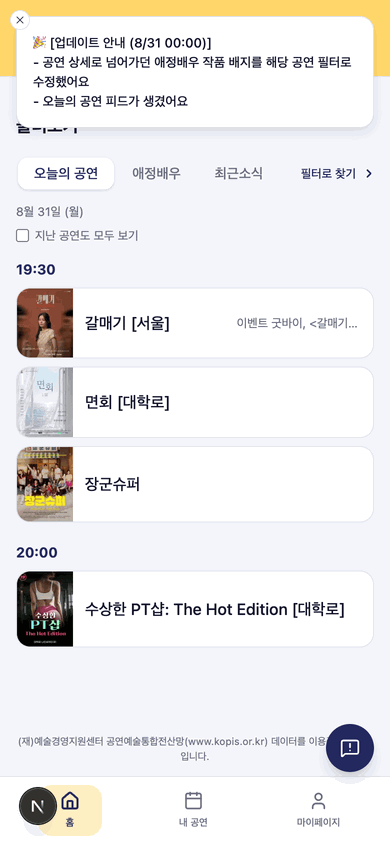
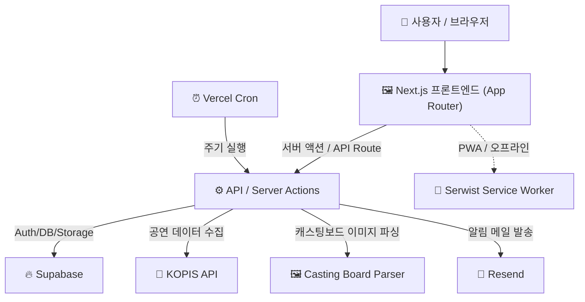

# 회전문

> 🔗 배포: [hoejeonmun.vercel.app](https://hoejeonmun.vercel.app)

## 📝 프로젝트 소개

**회전문**은 뮤지컬/연극 팬들이 흩어져 있는 **캐스팅 및 이벤트 정보를 한 곳에서 확인**할 수 있도록 만든 서비스입니다.

공연 캐스팅이나 이벤트 정보는 대개 SNS(X/트위터, 인스타그램)에 이미지나 텍스트로 공지되는데, 원하는 정보를 얻기 위해서는 여러 계정이나 사이트를 일일이 돌아다니며 이미지를 확인해야 하는 번거로움이 있습니다.

- **캐스팅보드/이벤트 이미지를 구조화된 데이터로 변환**하여 텍스트/캘린더 기반으로 검색/필터링할 수 있게 하기
- KOPIS(공연예술통합전산망) 공연 데이터를 주기적으로 수집해 **공연 기본 정보를 자동으로 갱신**하기
- 배우나 회차/이벤틀를 즐겨찾기하면 **즐겨찾기 된 정보를 모아보는** 개인화된 마이페이지 제공
- 모바일에서도 앱처럼 쓸 수 있도록 **PWA(오프라인 지원, 홈 화면 설치)**로 구현

### 주요 기능

- 공연/캐스팅 캘린더 뷰 — 날짜/배우별로 캐스팅 회차 필터링
- 오늘의 공연 리스트 - 오늘 하는 공연과 해당 공연의 이벤트 시간대 별로 조회
- 캐스팅보드 이미지 업로드 → 파싱 → 유저 검수 플로우
- 배우 즐겨찾기 및 마이페이지(내 즐겨찾기, 내가 등록한 캐스팅/이벤트)
- 카카오 소셜 로그인 (Supabase Auth 연동)
- Cron 기반 KOPIS 공연 자동 수집(`discover-castings`)
- 이메일 알림(Resend) — 오류 리포트, 버그 제보 등
- PWA 지원 (오프라인 지원)

## 📱 화면 구성



## 🛠️ 기술 스택

     

| 영역       | 사용 기술                                         |
| ---------- | ------------------------------------------------- |
| 프레임워크 | Next.js 16 (App Router), React 19                 |
| 언어       | TypeScript                                        |
| 스타일링   | Tailwind CSS, shadcn/ui, class-variance-authority |
| 백엔드/DB  | Supabase (Postgres, Auth, Storage)                |
| 인증       | 카카오 소셜 로그인 (Supabase Auth)                |
| 검증       | Zod                                               |
| 이메일     | Resend                                            |
| PWA        | Serwist (서비스워커)                              |
| 외부 API   | KOPIS(공연예술통합전산망)                         |
| 배포       | Vercel, Vercel Cron                               |
| 분석       | Vercel Analytics                                  |

## 🏗️ 아키텍처



**데이터 흐름 요약**

1. `Vercel Cron`이 주기적으로 `/api/cron/discover-castings`를 호출해 KOPIS에서 신규 공연 정보를 수집
2. 사용자가 캐스팅보드 이미지를 업로드하면 `/api/casting-boards/parse`가 이미지를 구조화된 캐스팅 데이터로 변환
3. 파싱 결과는 사용자가 직접 검수한 뒤 Supabase에 저장
4. 프론트엔드는 Supabase에서 공연/캐스팅/즐겨찾기 데이터를 조회해 캘린더/리스트 뷰로 렌더링
5. 카카오 로그인은 Supabase Auth를 통해 처리되며, 오류/버그 리포트는 Resend로 이메일 발송

## ⚡ 빠른 시작

```bash
# 1. 저장소 클론
git clone https://github.com/detourguru/hoejeonmun.git
cd hoejeonmun

# 2. 의존성 설치
npm install

# 3. 환경 변수 설정 (.env.local)
#   - NEXT_PUBLIC_SUPABASE_URL
#   - NEXT_PUBLIC_SUPABASE_ANON_KEY
#   - SUPABASE_SERVICE_ROLE_KEY
#   - RESEND_API_KEY
#   - KOPIS_API_KEY
#   (실제 필요한 값은 lib/supabase, lib/resend, lib/kopis 참고)

# 4. 개발 서버 실행
npm run dev
```

브라우저에서 <http://localhost:3000> 접속 후 확인합니다.
