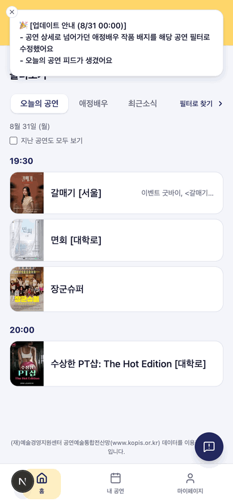
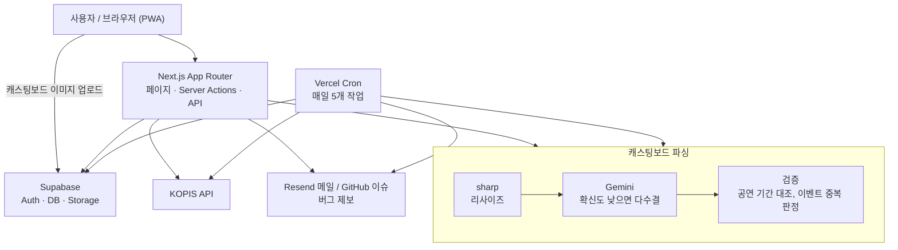
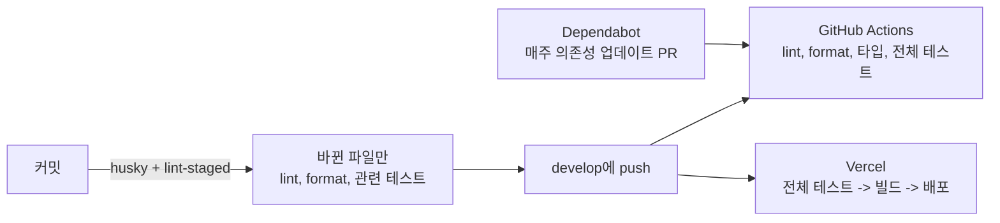

# 회전문

> 배포: [hoejeonmun.vercel.app](https://hoejeonmun.vercel.app)

[](https://github.com/detourguru/hoejeonmun/actions/workflows/ci.yml)

## 프로젝트 소개

**회전문**은 뮤지컬/연극 팬들이 흩어져 있는 **캐스팅 및 이벤트 정보를 한 곳에서 확인**할 수 있도록 만든 서비스입니다.

공연 캐스팅이나 이벤트 정보는 대개 SNS(X/트위터, 인스타그램)에 이미지나 텍스트로 공지되는데, 원하는 정보를 얻기 위해서는 여러 계정이나 사이트를 일일이 돌아다니며 이미지를 확인해야 하는 번거로움이 있습니다.

- **캐스팅보드/이벤트 이미지를 구조화된 데이터로 변환**하여 텍스트/캘린더 기반으로 검색/필터링할 수 있게 하기
- KOPIS(공연예술통합전산망) 공연 데이터를 주기적으로 수집해 **공연 기본 정보를 자동으로 갱신**하기
- 배우나 회차/이벤트를 즐겨찾기하면 **즐겨찾기 된 정보를 모아보는** 개인화된 마이페이지 제공
- 모바일에서도 앱처럼 쓸 수 있도록 **PWA(오프라인 지원, 홈 화면 설치)** 로 구현

### 주요 기능

- 공연/캐스팅 캘린더 뷰: 날짜/배우별로 캐스팅 회차 필터링
- 오늘의 공연 리스트: 오늘 하는 공연과 해당 공연의 이벤트 시간대 별로 조회
- 캐스팅보드 이미지 업로드 -> 파싱 -> 유저 검수 플로우
- 배우 즐겨찾기 및 마이페이지(내 즐겨찾기, 내가 등록한 캐스팅/이벤트)
- 카카오 소셜 로그인 (Supabase Auth 연동)
- Cron 기반 자동화: KOPIS 캐스팅보드 수집, 포스터 썸네일 생성, 사용자 등록 공연 병합, 파싱 실패 기록 정리
- 버그 제보: 이메일 알림(Resend) 및 GitHub 이슈 자동 등록
- PWA 지원 (오프라인 지원)

## 화면 구성

 공연 상세 -> 캐스팅보드 캘린더 -> 배우 검색 -> 배우 상세 -> 로그인 -> 마이페이지" />

## 기술 스택

        

| 영역        | 사용 기술                                                                             |
| ----------- | ------------------------------------------------------------------------------------- |
| 프론트엔드  | Next.js 16 (App Router), React 19, TypeScript, Tailwind CSS, shadcn/ui, Serwist (PWA) |
| 백엔드      | Supabase (Postgres, Auth, Storage), 카카오 소셜 로그인, Zod                           |
| AI/이미지   | Gemini (캐스팅보드 파싱), Jev (이벤트 중복 판정), sharp (리사이즈, 캡처 이어 붙이기)  |
| 외부 연동   | KOPIS (공연예술통합전산망), Resend (메일), GitHub Issues (버그 제보)                  |
| 테스트/품질 | Vitest, Testing Library, ESLint, Prettier, husky + lint-staged                        |
| 배포/운영   | Vercel (Cron, Analytics), GitHub Actions, Dependabot                                  |

## 아키텍처


```mermaid
flowchart TD
    User["사용자 / 브라우저 (PWA)"]
    App["Next.js App Router<br/>페이지 · Server Actions · API"]
    Cron["Vercel Cron<br/>매일 5개 작업"]

    subgraph Parser["캐스팅보드 파싱"]
        direction LR
        Sharp["sharp<br/>리사이즈"] --> Gemini["Gemini<br/>확신도 낮으면 다수결"] --> Check["검증<br/>공연 기간 대조, 이벤트 중복 판정"]
    end

    Supabase["Supabase<br/>Auth · DB · Storage"]
    KOPIS["KOPIS API"]
    Notify["Resend 메일 / GitHub 이슈<br/>버그 제보"]

    User --> App
    User -->|캐스팅보드 이미지 업로드| Supabase
    App --> Parser
    Cron --> Parser
    App --> Supabase
    App --> KOPIS
    Cron --> Supabase
    Cron --> KOPIS
    App --> Notify
    Cron --> Notify
```

**데이터 흐름 요약**

1. 브라우저가 캐스팅보드 이미지를 Supabase Storage에 직접 올리고, `/api/casting-boards/parse`가 이를 판독합니다.
2. Gemini가 한 번 읽고, 확신도가 낮으면 두 번 더 읽어 다수결로 배역을 확정합니다. 결과가 갈린 배역은 확인이 필요한 것으로 표시합니다.
3. 읽은 날짜/요일을 KOPIS 공연 기간과 대조하고, 이벤트는 Jev(실패 시 Gemini)로 중복을 판정합니다.
4. 사용자가 확인 화면에서 검수한 결과만 `/api/casting-boards`로 저장합니다.
5. 공연 정보는 KOPIS, 캐스팅/일정은 Supabase에서 가져와 캐시하고, 데이터가 바뀌면 캐시를 바로 비웁니다.
6. 카카오 로그인은 Supabase Auth로 처리하고, 캘린더 공유 링크는 로그인 없이 읽기 전용으로 열립니다.
7. 버그 제보는 저장과 함께 Resend로 메일을 보내고, GitHub 이슈는 Cron이 나중에 등록합니다.
8. `Vercel Cron`이 매일 아래 작업을 실행합니다.

| 경로                                   | 하는 일                                                    |
| -------------------------------------- | ---------------------------------------------------------- |
| `/api/cron/discover-castings`          | 오늘 개막하는 공연의 캐스팅보드를 KOPIS에서 찾아 자동 등록 |
| `/api/cron/generate-poster-thumbnails` | 포스터가 바뀐 공연만 썸네일 생성                           |
| `/api/cron/purge-parse-failures`       | 오래된 파싱 실패 이미지 삭제                               |
| `/api/cron/sync-bug-reports`           | 버그 제보를 GitHub 이슈로 등록                             |
| `/api/cron/merge-user-shows`           | 사용자가 등록한 공연이 KOPIS에 올라오면 병합               |

## CI/CD


```mermaid
flowchart LR
    Commit["커밋"] -->|husky + lint-staged| Hook["바뀐 파일만<br/>lint, format, 관련 테스트"]
    Hook --> Push["develop에 push"]
    Push --> CI["GitHub Actions<br/>lint, format, 타입, 전체 테스트"]
    Push --> Vercel["Vercel<br/>전체 테스트 -> 빌드 -> 배포"]
    Dependabot["Dependabot<br/>매주 의존성 업데이트 PR"] --> CI
```

- 커밋 직전에 바뀐 파일만 빠르게 검사하고, push 후 GitHub Actions가 저장소 전체를 검사합니다.
- Vercel은 배포 전에 전체 테스트를 실행하며, 실패하면 배포하지 않습니다(`vercel.json`의 `buildCommand`).
- Dependabot PR은 CI로만 검증하고 Vercel 미리보기 빌드는 건너뜁니다(`vercel.json`의 `ignoreCommand`).

## 빠른 시작

Node.js 22.22 이상, npm 11이 필요합니다. CI와 같은 버전을 쓰지 않으면 `npm ci`나 커밋 전 검사가 실패할 수 있습니다.

```bash
# 1. 저장소 클론
git clone https://github.com/detourguru/hoejeonmun.git
cd hoejeonmun

# 2. 의존성 설치 (git hook도 함께 연결됩니다)
npm ci

# 3. 환경 변수 설정 (.env.local)
#   - NEXT_PUBLIC_SUPABASE_URL, NEXT_PUBLIC_SUPABASE_PUBLISHABLE_KEY, SUPABASE_SECRET_KEY
#   - NEXT_KOPIS_API_URL, KOPIS_API_KEY
#   - GEMINI_API_KEY, JEV_API_KEY (없으면 이벤트 중복 판정도 Gemini로 처리)
#   - RESEND_API_KEY, BUG_REPORT_EMAIL_TO
#   - GITHUB_TOKEN, GITHUB_REPOSITORY (버그 제보 이슈 등록)
#   - CRON_SECRET, SYSTEM_UPLOAD_USER_ID (Cron 실행)

# 4. 개발 서버 실행
npm run dev
```

브라우저에서 <http://localhost:3000> 접속 후 확인합니다.

## 테스트 및 코드 품질

```bash
npm run test          # vitest watch 모드 (한 번만 실행: npx vitest run)
npm run test:ui        # vitest UI + 커버리지
npm run lint            # eslint
npm run format:check   # prettier 검사
npx tsc --noEmit        # 타입 체크
```

자동으로 실행되는 검사는 [CI/CD](#cicd)를 참고하세요.
